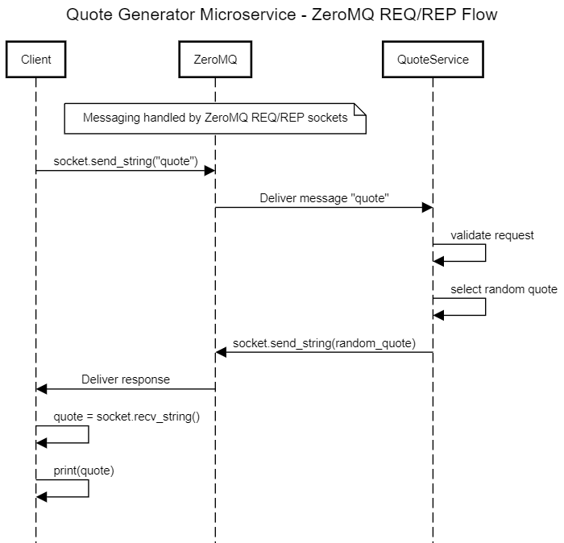

# Quote Generator Microservice

This microservice provides a randomized motivational quote in response to a request over a **ZeroMQ REQ/REP socket connection**.

---

## Communication Contract

This microservice uses the **ZeroMQ Request/Reply pattern (REQ/REP)** over TCP.

- **Socket Type:** REP (Reply)
- **Port:** `8765`
- **Protocol:** `tcp://<host>:8765`

Once connected, the client sends a **plain string message** to request a motivational quote. The server responds with a **plain string** containing a randomly selected quote.

---

## How to Programmatically REQUEST Data

To request a quote, your program must:
1. Create a `REQ` socket using ZeroMQ.
2. Connect to the microservice via TCP on port `8765`.
3. Send a string message: `"quote"` (or `"get quote"` or `"motivate"`).

### Example (Python)
```python
import zmq

context = zmq.Context()
socket = context.socket(zmq.REQ)
socket.connect("tcp://localhost:8765") 

socket.send_string("quote")  # Request the quote
```

---

## How to Programmatically RECEIVE Data

To receive the response, your application must:
1. Wait for a reply after sending the request.
2. Read the string returned by the microservice, which will contain a motivational quote.

### Example (Python)
```python
quote = socket.recv_string()
print("Received quote:", quote)
```

---

## Supported Requests

The microservice accepts the following request strings:
- `"quote"`
- `"get quote"`
- `"motivate"`

Any other request string will result in the following error message:
```
ERROR: Invalid request. Try 'quote' or 'motivate'.
```

This microservice is designed to return **one quote per request**. Each request must follow the REQ/REP message pattern exactly.

## Sequence Diagram

The diagram below illustrates how the client interacts with the quote microservice using ZeroMQ:



